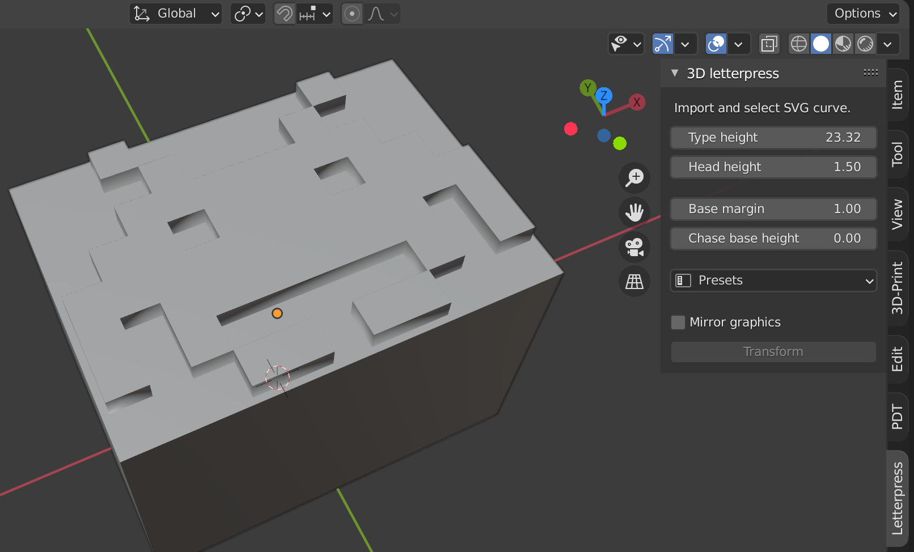
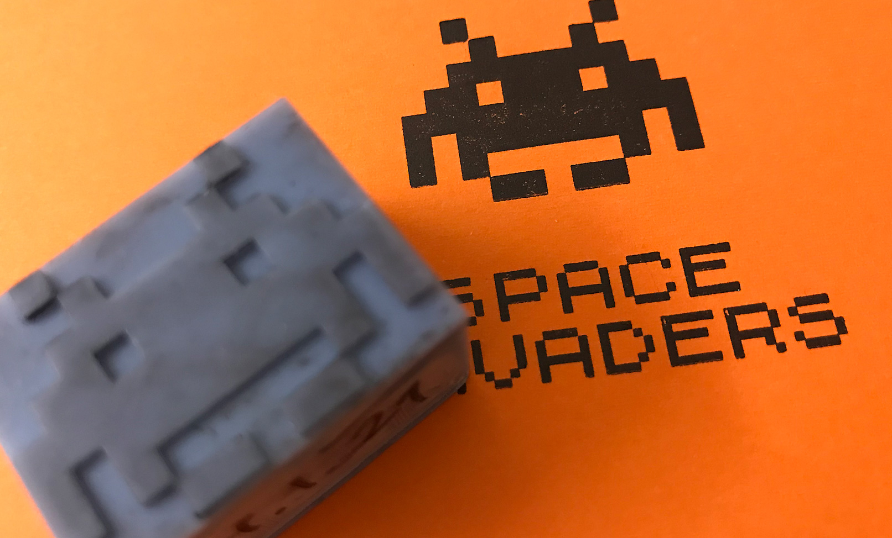

# blender-svg-letterpress
SVG to Letterpress Add-on with ability to set type hight of your letterpress machine, head height (extrusion), additional margin for base/body and chase base height if you use one. It can also mirror the final object if needed.

## How to use it

1. Go to Scripting workspace and load blender-svg-letterpress.py script.
2. Run script and you'll get new "Letterpress" panel in Object View.
3. Load SVG and select Curve (make sure SVG contains just one before export)
4. Set settings in panel and press Transform

Make sure that you make object manifold before exporting to STL (using 3D-Print addon).

## Installation
You can install add-on in Blender: Edit / Preferences / Install...

**Note:** SVG imported from Illustrator is extremelly small and I needed to scale it up. I did not test SVGs exported from other apps. You might need to tweek scale values in the script.

